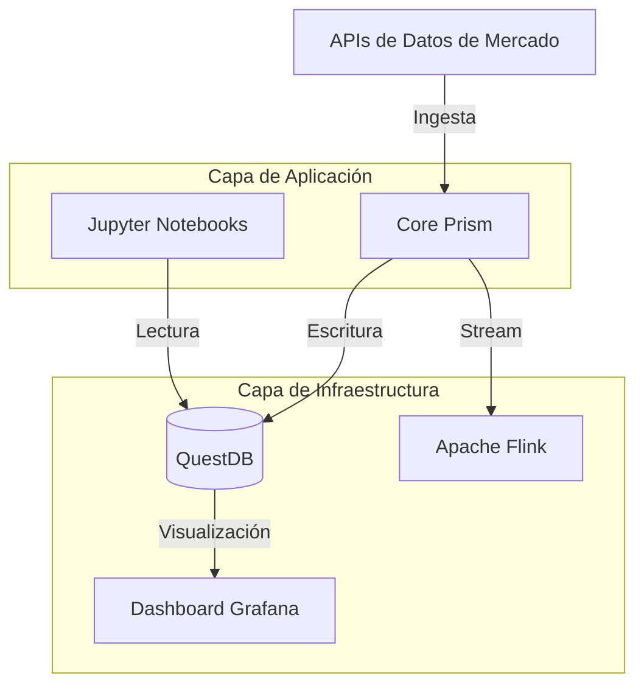

# Spectrum 
### Plataforma de Trading Cuantitativo de Alto Rendimiento


Spectrum es un stack de trading moderno, escalable y modular diseñado para el análisis cuantitativo, la ingesta de datos en tiempo real y el trading algorítmico. Separa la lógica central de la aplicación (`Prism`) de la infraestructura subyacente (`Platform`) para garantizar flexibilidad y rendimiento.

## 🏗️ Arquitectura

Spectrum está construido con una arquitectura inspirada en microservicios, desacoplando la capa de procesamiento de datos de la capa de almacenamiento y visualización.



## 🚀 Características Principales

- **Almacenamiento de Alto Rendimiento:** Utiliza **QuestDB** para el almacenamiento y recuperación ultrarrápida de series temporales.
- **Analítica en Tiempo Real:** Integración con **Apache Flink** para el procesamiento de streams con estado (en progreso).
- **Visualización Interactiva:** Dashboards de **Grafana** preconfigurados para monitorear datos de mercado y métricas del sistema.
- **Núcleo Modular (Prism):** Capa de aplicación basada en Python para procesadores de datos, algoritmos y servicios de utilidad, gestionada vía **Conda**.
- **Listo para Investigación:** Entornos de Jupyter Notebook integrados para backtesting de estrategias e investigación cuantitativa.
- **Contenerizado:** Configuración totalmente Dockerizada para un despliegue consistente en cualquier entorno.

## 🛠️ Stack Tecnológico

| Componente | Tecnología | Propósito |
| :--- | :--- | :--- |
| **Lógica Central** | Python 3.10+ | Algoritmos, Ingesta, Procesamiento |
| **Base de Datos** | QuestDB | Almacenamiento de series temporales de alta frecuencia |
| **Visualización** | Grafana | Dashboards en tiempo real y monitoreo |
| **Procesamiento** | Apache Flink | Procesamiento de streams y apps orientadas a eventos |
| **Orquestación** | Docker Compose | Gestión de contenedores |
| **Gestión de Env** | Conda | Aislamiento de dependencias Python |

## 📂 Estructura del Proyecto

```bash
spectrum/
├── platform/           # Configuraciones de infraestructura
│   ├── docker-compose.yml
│   ├── questdb/        # Esquemas y configuración de base de datos
│   └── grafana/        # Aprovisionamiento de dashboards
├── prism/              # Código de la aplicación
│   ├── algorithms/     # Estrategias de trading
│   ├── processors/     # Ingesta y transformación de datos
│   └── main.py         # Punto de entrada
├── notebooks/          # Investigación y Backtesting
└── LICENSE
```

## ⚡ Primeros Pasos

### Requisitos Previos

- **Docker** y **Docker Compose** instalados.
- **Conda** (Miniconda o Anaconda) para desarrollo local en Python.

### Instalación

1.  **Clonar el repositorio:**
    ```bash
    git clone https://github.com/ivangalindoangulo/spectrum.git
    cd spectrum
    ```

2.  **Iniciar la Plataforma (Infraestructura):**
    ```bash
    cd platform
    docker-compose up -d
    ```
    Esto iniciará QuestDB (puerto 9000), Grafana (puerto 3000) y Flink.

3.  **Configurar el Entorno Prism:**
    ```bash
    cd ../prism
    conda env create -f environment.yml
    conda activate spectrum-prism
    ```

### Uso

Accede a los siguientes servicios a través de tu navegador:

- **Consola de QuestDB:** [http://localhost:9000](http://localhost:9000)
- **Dashboards de Grafana:** [http://localhost:3000](http://localhost:3000) (Login: `admin`/`admin`)

## 🤝 Contribuciones

¡Las contribuciones son bienvenidas! Siéntete libre de enviar un Pull Request.

## 📄 Licencia

Este proyecto es de código abierto y está disponible bajo la [Licencia MIT](LICENSE).
