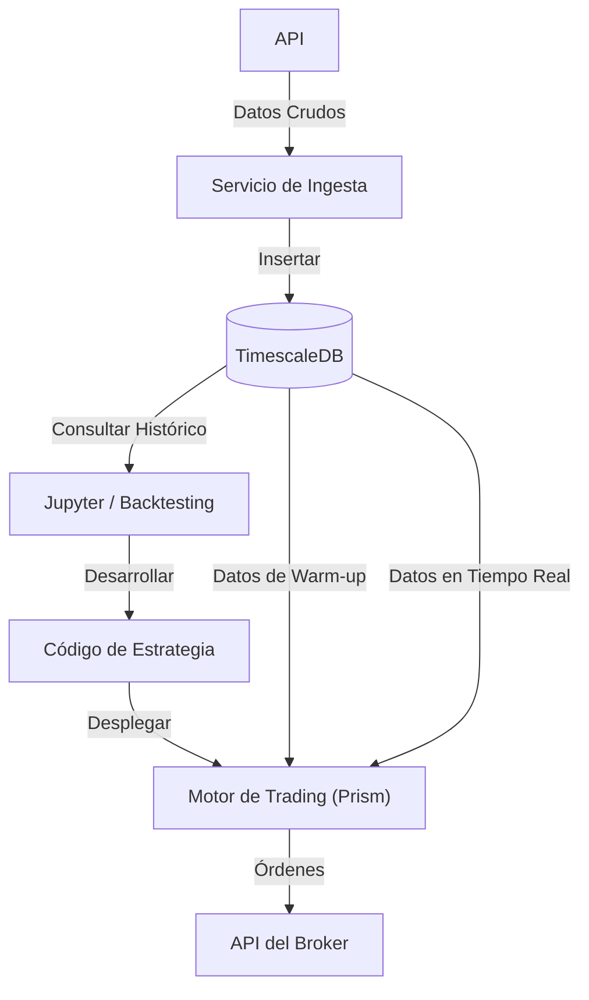

# Spectrum 
### Plataforma de Trading Cuantitativo de Alto Rendimiento


Spectrum es un stack de trading moderno, escalable y modular diseñado para el análisis cuantitativo, la ingesta de datos en tiempo real y el trading algorítmico. Separa la lógica central de la aplicación (`Prism`) de la infraestructura subyacente (`Platform`) para garantizar flexibilidad y rendimiento.

---

## 🏗️ Arquitectura

Spectrum aprovecha una arquitectura de microservicios contenerizada donde **TimescaleDB** (PostgreSQL) actúa como la fuente de verdad unificada, manejando tanto datos de mercado de series temporales de alta frecuencia como datos relacionales transaccionales (órdenes, estado del portafolio).



## 🚀 Ingeniería y Características Clave

*   **Motor de Almacenamiento Híbrido**: Explota las **Hypertables de TimescaleDB** para lograr un rendimiento de inserción O(1) en conjuntos de datos masivos de series temporales, manteniendo total compatibilidad SQL para consultas analíticas complejas.
*   **Pipeline de Ingesta Resiliente**: El servicio `Prism` implementa mecanismos de "backfilling" inteligente que detectan automáticamente huecos en los datos y reanudan la ingesta, asegurando la continuidad de los datos sin intervención manual.
*   **Esquema de Base de Datos Optimizado**: Un diseño meticuloso con 7 tablas core (`assets`, `market`, `models`, `signals`, `risk`, `orders`, `fills`), totalmente indexadas y particionadas por intervalos de tiempo.
*   **Código Limpio y Modularidad**: La lógica de la aplicación (Prism) está estrictamente separada de la orquestación de infraestructura. Las dependencias se gestionan vía **Conda** para asegurar entornos de investigación reproducibles.
*   **Observabilidad "First-Class"**: Integración nativa con **Grafana** que proporciona visualización en tiempo real de la latencia de datos, salud del sistema y rendimiento del trading.

## 🛠️ Stack Tecnológico

| Dominio | Tecnología | Evaluación |
| :--- | :--- | :--- |
| **Lógica de Negocio** | **Python 3.11+** | Seleccionado por su rico ecosistema en Ciencia de Datos (Pandas, NumPy) y capacidades modernas de AsyncIO. |
| **Base de Datos** | **TimescaleDB** | Elegido sobre QuestDB/InfluxDB por su capacidad para manejar datos relacionales (usuarios, portafolios) junto con métricas en un solo sistema ACID. |
| **Interfaz** | **Psycopg2** | Adaptador de PostgreSQL estándar en la industria, optimizado para inserciones por lotes de alto rendimiento. |
| **Orquestación** | **Docker Compose** | Simplifica el despliegue en entornos aislados y reproducibles (Infraestructura vs Aplicación). |
| **Visualización** | **Grafana** | Proporciona tableros altamente personalizables y sin código ("zero-code") conectados directamente a la BD. |

## 📂 Estructura del Proyecto

```bash
spectrum/
├── platform/           # Capa de Infraestructura
│   ├── docker-compose.yml
│   ├── timescaledb/    # Inicialización de BD y Definición de Esquema
│   │   └── init/schema.sql  # Definiciones de Hypertables
│   └── grafana/        # Aprovisionamiento de Tableros
├── prism/              # Capa de Aplicación (Lógica de Negocio)
│   ├── docker-compose.yml
│   ├── environment.yml # Lockfile de Entorno Conda
│   ├── engine/         # Ejecutor de Estrategias Cuantitativas
│   ├── ingestion/      # Ingestores de Datos Multi-fuente
│   ├── storage/        # Capa de Abstracción de Base de Datos
│   └── utils/          # Configuración y Logging
└── notebooks/          # Sandboxes de Investigación y Backtesting
```

## ⚡ Inicio Rápido

### Requisitos Previos
*   Docker Desktop y Docker Compose
*   Git

### Despliegue

**1. Capa de Infraestructura** (Base de Datos y Monitoreo)
```bash
cd platform
docker-compose up -d
# Servicios: TimescaleDB (Puerto 5432), Grafana (Puerto 3000)
```

**2. Capa de Aplicación** (Servicio Prism)
```bash
cd ../prism
docker-compose build
docker-compose up -d
```

### Verificación
Accede al contenedor de la base de datos en ejecución para verificar la ingesta de datos:
```bash
docker exec -it spectrum-timescaledb psql -U postgres -d spectrum -c "SELECT ticker, count(*) FROM market GROUP BY ticker;"
```

## 📧 Contacto
**Ivan Galindo Angulo**  
[Perfil de GitHub](https://github.com/ivangalindoangulo)  

---
*Proyecto de Código Abierto liberado bajo la [Licencia MIT](LICENSE).*
