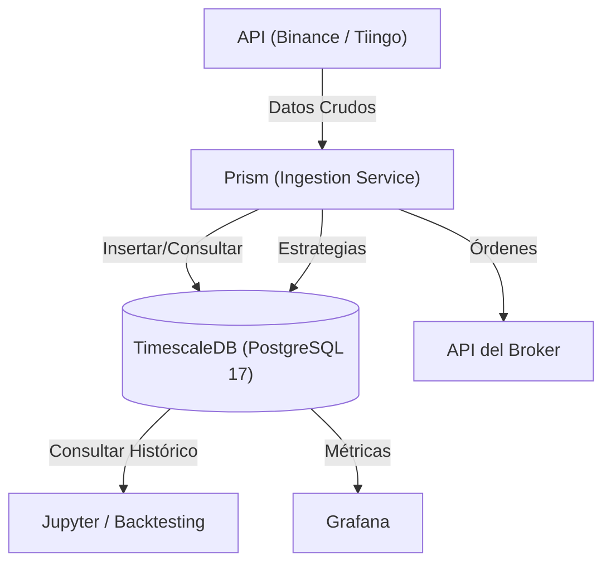

# Spectrum 
### Plataforma de Trading Cuantitativo de Alto Rendimiento


Spectrum es un stack de trading moderno, escalable y modular diseñado para el análisis cuantitativo, la ingesta de datos en tiempo real y el trading algorítmico. Separa la lógica central de la aplicación (`Prism`) de la infraestructura subyacente (`Platform`) para garantizar flexibilidad y rendimiento.

## 🏗️ Arquitectura

Spectrum utiliza una arquitectura de microservicios contenerizada donde **TimescaleDB** (basado en PostgreSQL) actúa como la fuente de verdad unificada para series temporales y datos relacionales.



## 🚀 Características Principales

- **Almacenamiento Híbrido:** Utiliza **TimescaleDB** para combinar la velocidad de series temporales con la robustez relacional de PostgreSQL.
- **Ingesta Robusta:** Servicio `Prism` diseñado para backfill inteligente y streaming en tiempo real (Binance/Tiingo).
- **Esquema Unificado:** Base de datos estructurada con 7 tablas principales (`assets`, `market`, `models`, `signals`, `risk`, `orders`, `fills`), optimizadas con **Hypertables**.
- **Visualización Interactiva:** Dashboards de **Grafana** conectados nativamente a la base de datos.
- **Núcleo Modular (Prism):** Lógica en Python 3.11+ gestionada con **Conda**, utilizando `psycopg2` para máxima eficiencia.
- **Contenerizado:** Despliegue orquestado mediante Docker Compose separado para Infraestructura y Aplicación.

## 🛠️ Stack Tecnológico

| Componente | Tecnología | Propósito |
| :--- | :--- | :--- |
| **Lógica Central** | Python 3.11+ | Ingesta, Estrategias, Backtesting |
| **Base de Datos** | TimescaleDB | SQL + TimeSeries (Hypertable) |
| **Driver DB** | Psychopg2 | Conector Python-Postgres de alto rendimiento |
| **Visualización** | Grafana | Dashboards en tiempo real |
| **Orquestación** | Docker Compose | Gestión de contenedores (Platform & Prism) |
| **Gestión de Env** | Conda | Aislamiento de dependencias Python |

## 📂 Estructura del Proyecto

```bash
spectrum/
├── platform/           # Infraestructura (Base de Datos, Monitoreo)
│   ├── docker-compose.yml
│   ├── timescaledb/    # Datos persistentes e inicialización (schema.sql)
│   └── grafana/        # Configuración de tableros
├── prism/              # Lógica de Negocio (Python App)
│   ├── docker-compose.yml
│   ├── environment.yml # Dependencias Conda
│   ├── engine/         # Motor de estrategias
│   ├── ingestion/      # Servicios de descarga de datos
│   ├── storage/        # Manejadores de Base de Datos (TimescaleHandler)
│   └── utils/          # Configuración global
└── notebooks/          # Investigación y Backtesting
```

## ⚡ Primeros Pasos

### Requisitos Previos

- **Docker** y **Docker Compose**.
- **Conda** (opcional, para desarrollo local).

### Instalación y Despliegue

1.  **Clonar el repositorio:**
    ```bash
    git clone https://github.com/ivangalindoangulo/spectrum.git
    cd spectrum
    ```

2.  **Desplegar la Plataforma (Infraestructura):**
    Esta capa levanta la base de datos y grafana.
    ```bash
    cd platform
    # Limpia volúmenes antiguos si es necesario reiniciar el esquema
    # docker-compose down -v 
    docker-compose up -d
    ```
    *   **TimescaleDB**: Puerto `5432`
    *   **Grafana**: Puerto `3000` (Login: `admin`/`admin`)

3.  **Desplegar Prism (Aplicación):**
    Esta capa construye la imagen de Python con las dependencias y ejecuta la ingesta.
    ```bash
    cd ../prism
    docker-compose build
    docker-compose up -d
    ```

### Validación del Sistema

Puedes verificar que la base de datos esté recibiendo datos accediendo al contenedor:

```bash
# Ver últimos registros de mercado
docker exec -it spectrum-timescaledb psql -U postgres -d spectrum -c "SELECT * FROM market ORDER BY ts DESC LIMIT 5;"
```

## 📄 Licencia

Este proyecto es de código abierto y está disponible bajo la **Licencia MIT**.
